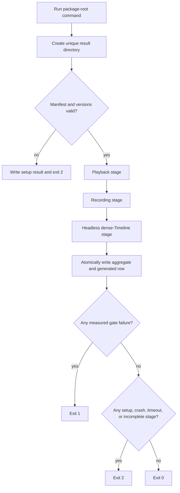
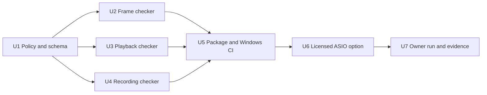

# H17 Packaged Hardware Verifier - Plan

## Goal Capsule

- **Objective:** let Dan unzip the Windows alpha package, run one command with no arguments, and receive a mechanical verdict for packaged playback, recording, and dense-Timeline frame behavior on the default hardware.
- **Product authority:** ADR-0040 owns the package-level interface. ADR-0037, the H17 distribution plan, and `docs/reality-lane.md` retain the locked gate thresholds and result-accounting rules.
- **Execution profile:** seven small code checkpoints covering shared verdict policy, three packaged checkers, package/CI wiring, ASIO, and the owner-machine evidence run.
- **Authority order:** accepted ADRs and the Product Contract outrank this plan's implementation choices; repository instructions and `STATUS.md` control checkpoint execution.
- **Open owner gate:** proprietary ASIO integration may be prepared only after Dan completes the applicable Steinberg agreement. No SDK source is vendored and no licence acceptance is inferred.
- **Stop condition:** the package-root command is mechanically self-testing in CI and produces an honest owner-machine PASS, measured FAIL, or setup result without a checkout, build tools, UI operation, listening, or visual judgment.
- **Tail ownership:** every U-ID is a separate green checkpoint. Update `STATUS.md`, commit, push, and wait for that commit's remote CI before starting the next U-ID.

---

## Product Contract

### Summary

The Windows portable alpha will ship one self-contained hardware-verification command. It will automatically exercise packaged playback, recording, and the accepted headless dense-Timeline frame proxy, then emit one structured result, one plain summary, and one generated Reality-lane row.

### Problem Frame

The Reality lane is mechanically defined but not owner-usable from the package. Playback resolves a build-tree executable, the frame smoke configures and builds the repository, and the recording smoke does not exist. A user who only has the portable zip cannot run the proof that H17 requires.

The current Windows machine also exposes an important truth the verifier must preserve: shared and exclusive WASAPI grant Blocks larger than the locked 128-frame target. The tool must explain that failure and pursue the supported low-latency backend route, never lower the target to create a green result.

### Key Decisions

- **Package-root workflow** (session-settled: user-directed — chosen over a manual UI or developer workflow: Dan does not use those workflows). Governs R1-R4.
- **Automatic hardware defaults** (session-settled: user-approved — chosen over a device picker: the verifier must be usable without UI knowledge). Governs R5-R7.
- **Measured evidence is the only PASS authority** (session-settled: user-approved — chosen over hand-written verification notes: every claim must be mechanically derived). Governs R8-R11.
- **Keep the 128-frame target** (session-settled: user-approved — chosen over crediting the observed 480-frame stability run: the plan's latency gate remains binding). Governs R12-R14.
- **One orchestrator, three explicit stages** (session-settled: user-approved — chosen over one monolithic checker: playback, recording, and frame evidence must remain separately attributable). Governs R15-R21.
- **Preserve the accepted frame claim boundary.** The packaged frame stage proves the existing headless dense-Timeline proxy, not real-window GPU presentation. Governs R18-R19.
- **Keep degraded recording explicit.** Capture-only evidence may pass the recording stage exactly as `docs/reality-lane.md` permits, but it must state that alignment was not proved. Governs R15-R17.
- **Pursue the proprietary ASIO path without assuming a purchase.** YES DAW remains eligible to be closed-source or commercial; Dan retains the agreement step. Governs R6-R7 and R22-R23.

### Requirements

**Owner workflow and package boundary**

- R1. The Windows portable package must contain one root-level `verify-hardware.ps1`.
- R2. `powershell -NoProfile -ExecutionPolicy Bypass -File .\verify-hardware.ps1` with no verifier arguments must be the documented package-root path. The verifier itself must remain independent of the process current directory, as proved by invoking its absolute extracted-package path from an unrelated directory.
- R3. The normal path must not require a repository checkout, CMake, CTest, a compiler, a development server, or app UI operation.
- R4. Every executable used for gate credit must resolve under the extracted package root, report the package version, and match a package manifest containing its relative path, byte size, and SHA-256.

**Automatic hardware selection**

- R5. The verifier must automatically select a usable default input and output route without a picker.
- R6. On Windows, the verifier must try a packaged ASIO capability first when present, then deterministic supported WASAPI low-latency modes.
- R7. The result must identify every backend and device attempt, including stable reason codes for rejection, ambiguity, busy devices, missing channels, unsupported sample rate, and unsupported Block.

**Evidence and verdict**

- R8. The verifier must write schema-versioned, locale-invariant JSON containing package identity, stage states, claim levels, route provenance, measured values, failure codes, backend attempts, timestamps, durations, and the final verdict.
- R9. The verifier must print a concise summary that requires no interpretation of raw logs and identifies the retained result directory.
- R10. Exit code `0` means every required stage passed its permitted claim, `1` means at least one completed measurement violated a gate, and `2` means no measured failure occurred but setup, package integrity, child crash/hang, or incomplete execution prevented a complete verdict.
- R11. A proposed `docs/reality-lane.md` row must be generated from structured measurements. A human or agent may verify provenance and commit the row, but may not manually upgrade its classification or claim level.

**Playback**

- R12. Playback must use a real Project through the packaged runtime and request 48 kHz with a 128-frame Block.
- R13. Playback must fail when the granted sample rate differs from 48 kHz, the granted Block exceeds 128 frames, any authoritative Underrun occurs, any valid callback-budget metric is breached, the device reports an error, the Project does not render non-silent output, or required loopback evidence is invalid.
- R14. A run at any relaxed Block size or without an authoritative deadline metric may be retained as diagnostic evidence but must not earn the locked playback PASS.

**Recording**

- R15. Recording must capture through the packaged runtime, use the bounded recording path, persist the result as the canonical bundle-owned float-WAV Asset plus Clip and Take metadata, reopen the Project, and assert non-silence, zero dropped frames, format validity, linkage, and sample identity.
- R16. Recording may assert compensated placement within the ADR-0018 tolerance only when the selected input is mechanically identified as a device loopback endpoint and correlation finds the coded burst. Correlation through a microphone or an input without proved route provenance cannot earn full alignment credit.
- R17. When loopback ground truth is unavailable but capture and persistence pass, the recording stage may return PASS only with `claim_level: capture_only`, `alignment_status: not_claimed`, and a generated row that says the same.

**Frame**

- R18. The package must run the accepted headless dense-Timeline proxy without configuring or building the repository.
- R19. The owner policy must fail on blank output or sustained frame time at or above 16.6 ms and must not inherit a CI-environment relaxation. The evidence must call the claim `headless_dense_timeline`, never `window_gpu`.

**Gate integrity**

- R20. CI must prove that missing, path-escaping, version-mismatched, or hash-mismatched package files; wrong sample rate; a Block above 128; synthetic Underruns; child crash/hang/no JSON; recording FIFO drops; silent or invalid recording output; broken persisted linkage; invalid loopback alignment; blank frame output; an over-budget frame; and mixed stage outcomes cannot produce a false PASS.
- R21. After package integrity succeeds, independent stages must continue after another stage fails so the run retains maximum evidence. The orchestrator must synthesize a terminal stage record after a child crash, timeout, or missing result; power loss is outside the durability guarantee.

**ASIO boundary**

- R22. ASIO must be an explicit Windows build option that consumes an owner-supplied external SDK path, leaves ordinary CI and non-ASIO builds green, and never downloads or vendors SDK material.
- R23. The package manifest and result must state whether ASIO was compiled in. No ASIO-enabled artifact may be distributed until the applicable proprietary agreement and redistribution path are documented by the owner.

### Actors

- A1. **Dan:** extracts the portable package, completes any owner-only licence step, and runs one command.
- A2. **Packaged orchestrator:** validates package identity, launches stages, aggregates verdicts, and writes durable evidence.
- A3. **Packaged stage checker:** performs one real measurement and emits one stage JSON document.
- A4. **CI:** exercises package boundaries, policy, and negative controls without claiming real-hardware PASS.
- A5. **Agent:** reviews and commits script-generated Reality-lane evidence without changing its classification.

### Key Flows

- F1. Package verification
  - **Trigger:** A1 runs the package-root command with no verifier arguments.
  - **Actors:** A1, A2, A3
  - **Steps:** A2 creates a unique result directory, validates the manifest and compiled versions, runs playback, recording, and frame stages with timeouts, then atomically writes the aggregate.
  - **Outcome:** the console, exit code, aggregate JSON, stage JSON, and generated row agree on PASS, measured FAIL, or setup-incomplete.
  - **Covers:** R1-R21.
- F2. Reality-lane evidence handoff
  - **Trigger:** F1 reaches a terminal verdict.
  - **Actors:** A2, A5
  - **Steps:** A2 generates a dated result row from measurements; A5 verifies package hash and provenance and commits it unchanged.
  - **Outcome:** git records the real-machine fact without agent-authored measurement or classification.
  - **Covers:** R8-R11, R17, R19, R21.
- F3. Package self-test
  - **Trigger:** package CI runs `verify-hardware.ps1 -SelfTest` from a clean extraction outside the checkout.
  - **Actors:** A2, A4
  - **Steps:** A4 injects named fixture results and copied-package mutations through the production manifest and verdict policy.
  - **Outcome:** every prohibited condition prevents false PASS without requiring CI audio hardware.
  - **Covers:** R4, R8-R10, R20-R21.
- F4. Licensed ASIO build
  - **Trigger:** A1 records completion of the applicable proprietary agreement and supplies an SDK directory locally.
  - **Actors:** A1
  - **Steps:** A1 invokes the local Windows build with the owner-supplied SDK; the build enables ASIO, records the capability in all version surfaces, and packages only compiled objects, never SDK source. A4 retains the ordinary no-SDK CI coverage in U6.
  - **Outcome:** the owner package can automatically attempt the Focusrite ASIO route before WASAPI.
  - **Covers:** R6-R7, R22-R23.

### Acceptance Examples

- AE1. Clean package success
  - **Covers:** R1-R13, R15-R21.
  - **Given:** a clean extracted package, supported default devices, and valid stage outputs.
  - **When:** Dan runs the root verifier with no verifier arguments.
  - **Then:** all three stages pass, one unique result directory records the package and device measurements, a row is generated, and the process exits `0`.
- AE2. Device refuses the target Block
  - **Covers:** R7, R10, R12-R14, R21.
  - **Given:** the request is 48 kHz/128 and the selected backend grants 48 kHz/480.
  - **When:** playback completes with no Underrun.
  - **Then:** playback and overall verdicts are still FAIL, the granted Block is recorded, other stages still run, and the process exits `1`.
- AE3. No loopback ground truth
  - **Covers:** R10, R15-R17, R21.
  - **Given:** default input capture is available but the known output burst cannot be correlated.
  - **When:** bounded capture, persistence, reopen, non-silence, linkage, and format checks pass.
  - **Then:** recording passes only as `capture_only`, alignment is `not_claimed`, and no zero-frame alignment value is invented.
- AE4. Package contamination
  - **Covers:** R4, R8, R10, R20-R21.
  - **Given:** a checker is missing, modified, version-mismatched, or resolves outside the package.
  - **When:** verification starts.
  - **Then:** no hardware stage launches, evidence names the package-integrity reason, and the process exits `2`.
- AE5. Frame regression
  - **Covers:** R10, R18-R21.
  - **Given:** the packaged dense-Timeline proxy renders blank output or reaches 16.6 ms sustained frame time.
  - **When:** the frame stage finishes.
  - **Then:** the evidence names the headless proxy, the overall verdict is FAIL, and the process exits `1`.
- AE6. Mixed outcome
  - **Covers:** R8-R10, R20-R21.
  - **Given:** playback measures a 480-frame FAIL and recording later times out.
  - **When:** aggregation completes.
  - **Then:** both states are preserved and measured failure precedence makes the process exit `1`.
- AE7. ASIO not compiled
  - **Covers:** R6-R7, R22-R23.
  - **Given:** the ordinary package was built without an owner-supplied SDK.
  - **When:** verification runs on Windows.
  - **Then:** evidence records `asio_compiled: false`, WASAPI attempts remain honest, and no missing-SDK download or false setup success occurs.

### Success Criteria

- Dan's normal workflow is exactly unzip, open PowerShell in the package folder, and run the documented command.
- CI proves all R20 negative controls through the same policy used by the package.
- Every packaged child reports the same non-fallback version and matches the manifest.
- The owner-machine output is complete enough to append a Reality-lane row without transcription.
- A package that cannot meet 48 kHz/128 exits nonzero and explains why; thresholds are never revised by the verifier.

### Scope Boundaries

- The verifier does not automate the DAW GUI or ask Dan to listen, watch, inspect, or choose a device.
- It does not claim a real-window/GPU measurement; the accepted frame claim remains the headless dense-Timeline proxy.
- It does not lower the 128-frame target, reinterpret diagnostic stability as gate credit, or convert capture-only recording evidence into alignment proof.
- It does not add an installer, signing, telemetry, public-beta distribution, or automatic repository editing.
- It does not automate H17 CP5's real-song create/edit/mix/export session.
- It does not include the real-plugin worker smoke, which remains a separate Reality-lane concern.

### Dependencies and Assumptions

- ADR-0040 is the interface authority; ADR-0037 and `docs/reality-lane.md` remain the result-accounting authority.
- Dan approved planning toward the proprietary ASIO path; actual agreement completion remains owner evidence.
- The no-argument verifier grants full recording alignment only for a mechanically identified device loopback endpoint. A physical cable or unclassified input remains capture-only unless a later ADR defines a separate mechanically configured owner lane.
- CI can prove orchestration, package isolation, schema, and negative controls but cannot manufacture real hardware evidence.
- Windows PowerShell 5.1 is the compatibility floor. Repository `.ps1` files remain ASCII-only unless deliberately encoded with a BOM.

### Outstanding Questions

No question blocks U1-U5. U6 begins only after Dan supplies the owner evidence named in KTD8. A failed owner run becomes measured evidence and follow-up work; it does not authorize changing a gate.

### Sources and Research

- `STATUS.md`
- `docs/reality-lane.md`
- `docs/solutions/h0-build-and-ci-gotchas.md`
- `docs/plans/2026-07-03-h17-distribution-alpha-plan.md`
- `docs/adr/0018-recording-latency-and-take-writer.md`
- `docs/adr/0035-h13-recording-and-device-ux.md`
- `docs/adr/0036-recorded-audio-assets-and-takes.md`
- `tools/soak/SoakMain.cpp`
- `tools/soak.ps1`
- `tools/package.ps1`
- `tools/ui-frame-smoke.ps1`
- `src/engine/Recording.h`
- `src/ui/UiAppModel.h`
- `src/persistence/ProjectBundle.h`
- `tests/recording_ux_tests.cpp`
- `tests/timeline_gpu_tests.cpp`
- `.github/workflows/ci.yml`
- [Steinberg ASIO open-source licence variant](https://www.steinberg.net/developers/asiosdk-open/)
- [Steinberg developer licensing overview](https://www.steinberg.net/developers/)
- [JUCE 8.0.4 ASIO integration requirements](https://github.com/juce-framework/JUCE/blob/8.0.4/modules/juce_audio_devices/juce_audio_devices.cpp)
- [JUCE audio device enumeration](https://docs.juce.com/master/classjuce_1_1AudioIODeviceType.html)

---

## Planning Contract

### Key Technical Decisions

- KTD1. (session-settled: user-approved — chosen over one monolithic checker: distinct stages remain independently testable and attributable) Stage `tools/verify-hardware.ps1` at package root and compose three dedicated console binaries: `YesDawHardwarePlaybackCheck`, `YesDawHardwareRecordingCheck`, and `YesDawFrameCheck`. The script owns identity validation, child timeouts, aggregation, exit code, and row generation. Governs R1-R4, R8-R11, R20-R21.
- KTD2. Put the schema, stage states, failure codes, and aggregate verdict policy in a reusable production-side `src/app/HardwareVerification.h`; C++ checkers and deterministic tests use it directly, while the PowerShell self-test validates equivalent aggregate fixtures. Do not extend `YesDawSelfCheck`, whose contract stays device/display-free. Governs R8-R10, R20-R21.
- KTD3. Each child writes one locale-invariant JSON file to a path supplied by the orchestrator. The child writes a sibling temporary file and atomically replaces the final file. The orchestrator does the same for `result.json` and `reality-lane-row.txt`. Governs R8-R11, R21.
- KTD4. Use a unique `hardware-results/<UTC timestamp>-<package version>/` directory under the extracted package. Retain stage JSON, aggregate JSON, generated row, captured canonical Project, and bounded logs; never overwrite a prior run. Governs R8-R9, R11, R15-R17, R21.
- KTD5. Generate `package-manifest.json` in `tools/package.ps1` after staging. It lists the verifier, version file, and all invoked binaries with package-relative path, size, SHA-256, and compiled version. The verifier resolves literal paths from `$PSScriptRoot`, validates the complete manifest before launching children, and never searches `PATH` or build trees. Governs R3-R4, R20.
- KTD6. Evolve the existing real-Project soak into `YesDawHardwarePlaybackCheck`; do not duplicate its playback engine path. Replace manual JSON construction with JUCE JSON serialization, request both sample rate and Block explicitly, record every backend/device attempt, and count only authoritative xrun/device/callback metrics. The existing inter-arrival heuristic remains diagnostic until proved valid for the chosen backend. Governs R5-R7, R12-R14.
- KTD7. Extract canonical recorded-audio commit logic from `UiAppModel` into a control-side service shared by the app and checker. `YesDawHardwareRecordingCheck` sends a coded burst, captures through the bounded FIFO, records stable input-route provenance, searches input channels for a correlation peak, and commits the real captured samples through that shared service. It never calls the synthetic `recordDeterministicTestAudioTake()` helper. Full alignment requires both a mechanically identified device loopback endpoint and valid correlation; every other valid capture remains capture-only. Governs R15-R17, R20.
- KTD8. (session-settled: user-approved — chosen over GPLv3 integration: YES DAW should remain eligible for closed-source or commercial distribution) Add ASIO as an opt-in Windows build using an owner-supplied external SDK directory. Before U6 starts, Dan records completion of the applicable Steinberg proprietary agreement and the repository documents the allowed build and redistribution path. Do not vendor, fetch, cache, or publish SDK source. Governs R6-R7, R22-R23.
- KTD9. Extract the dense-Timeline fixture and measurement policy from `tests/timeline_gpu_tests.cpp` into `src/ui/TimelineFrameCheck.h`. Keep the current Catch2 target as a regression test and add `YesDawFrameCheck` as a small JSON-emitting console entry point. The owner threshold is fixed and ignores ambient `CI`; evidence names only `headless_dense_timeline`. Governs R18-R20.
- KTD10. `-SelfTest` is a clearly separate, device-free path in `verify-hardware.ps1`. It uses immutable fixture results and copied-package mutations but calls the same manifest and aggregation functions as the normal path. There are no production flags that relax thresholds or inject PASS values. Governs R20-R21.
- KTD11. After package integrity passes, stage state is one of `pass`, `fail`, `setup`, `crash`, or `skipped`. Aggregate precedence is: any measured `fail` produces exit `1`; otherwise any `setup`, `crash`, or `skipped` produces exit `2`; only all permitted `pass` states produce exit `0`. Capture-only is a claim level on a passing recording stage, not a hidden state. Governs R8-R10, R17, R21.
- KTD12. Add a Windows package CI job rather than overloading the existing Linux package job. It builds the Windows package, extracts it outside the checkout, changes to an unrelated working directory, runs the packaged `-SelfTest`, and performs package mutations on disposable copies. It never claims a hardware PASS. Governs R3-R4, R20-R23.

### Result Schema

`schema_version: 1` is additive-compatible: readers ignore unknown fields, but removal, rename, type change, or semantic change requires a new schema version and matching fixtures.

The aggregate owns:

- `schema_version`, `package_version`, `package_manifest_sha256`, `asio_compiled`;
- `run_id`, UTC `started_at`/`completed_at`, host OS and machine name;
- `overall_state`, `exit_code`, stable `failure_codes`;
- ordered `backend_attempts`;
- `stages.playback`, `stages.recording`, and `stages.frame`;
- `generated_row_path` and retained artifact paths.

Each stage owns:

- `state`, `claim_level`, `started_at`, `completed_at`, `duration_ms`;
- `measurements` with requested and granted values kept distinct;
- stable `failure_codes`, bounded human `detail`, and checker version;
- stage-specific artifact hashes.

### Failure and Durability Policy

- Package-integrity failure stops before hardware launch and atomically writes an exit-`2` aggregate.
- Child output is accepted only when its schema, run ID, stage name, and checker version match the invocation.
- Each child has a documented timeout. Timeout, abnormal exit, or missing/invalid JSON becomes a synthesized terminal stage record while later independent stages continue.
- A completed measurement that violates a threshold is never converted into setup failure.
- The script prints audible-playback notice as information only; no confirmation is requested.
- Result retention is local to the extracted package and contains no telemetry or automatic upload.

### Sequencing

U2-U4 may be implemented in any order after U1, but repository checkpoint rules still permit only one active checkpoint at a time. U6 is not entered without its owner gate. U7 uses the exact package produced after U6.

---

## Implementation Units

### U1. Shared schema, verdict policy, and device-free self-test

- **Goal:** create the stable evidence and aggregation contract before any packaged stage depends on it.
- **Requirements:** R8-R10, R17, R20-R21.
- **Dependencies:** none.
- **Files:**
  - `src/app/HardwareVerification.h`
  - `tests/hardware_verification_tests.cpp`
  - `tools/verify-hardware.ps1`
  - `CMakeLists.txt`
  - `STATUS.md`
- **Approach:**
  - Define schema v1 types, stable failure codes, stage states, claim levels, and KTD11 aggregation.
  - Implement locale-invariant JSON read/write helpers and atomic replacement.
  - Add device-free fixtures for clean PASS, measured FAIL, setup, crash, mixed outcomes, and capture-only.
  - Implement the script's `-SelfTest` route using the same aggregation functions the normal path will call.
  - Keep the script Windows PowerShell 5.1-compatible and ASCII-safe.
- **Test Scenarios:**
  - All stages pass and aggregate to exit `0`.
  - A 480-frame playback result plus recording timeout retains both and aggregates to exit `1`.
  - Capture-only recording passes with `alignment_status: not_claimed`; an invented zero alignment is rejected.
  - Child crash, timeout, missing JSON, wrong schema, or wrong run ID becomes exit `2` when no measured failure exists.
  - Malformed strings serialize as valid escaped JSON under a non-English process locale.
- **Verification:**
  - `cmake --build --preset ci --target YesDawHardwareVerificationCheck`
  - `ctest --preset ci -R YesDawHardwareVerificationCheck --output-on-failure`
  - `powershell -NoProfile -ExecutionPolicy Bypass -File tools\verify-hardware.ps1 -SelfTest`
  - Full repository build/test and remote CI.

### U2. Reusable headless dense-Timeline frame checker

- **Goal:** package the already accepted mechanical frame proxy without a checkout or Catch2 runtime.
- **Requirements:** R18-R21.
- **Dependencies:** U1.
- **Files:**
  - `src/ui/TimelineFrameCheck.h`
  - `tools/hardware/FrameCheckMain.cpp`
  - `tests/timeline_gpu_tests.cpp`
  - `tests/hardware_verification_tests.cpp`
  - `CMakeLists.txt`
  - `STATUS.md`
- **Approach:**
  - Extract fixture construction, nonblank sampling, visible-clip capacity, slow-frame counting, and timing into a reusable helper.
  - Preserve the current Catch2 regression target by calling the helper.
  - Add `YesDawFrameCheck --version` and JSON output modes.
  - Make the owner policy fixed at sustained `<16.6 ms`; CI-specific tolerance stays only in the Catch2 regression configuration.
  - Emit `claim_level: headless_dense_timeline` and never label the result as a GPU/window proof.
- **Test Scenarios:**
  - Dense fixture renders nonblank under budget and emits valid schema v1 JSON.
  - Blank fixture, insufficient visible clips, and over-budget timing each fail with distinct codes.
  - Ambient `CI=1` does not relax the packaged checker.
  - Checker version matches `YESDAW_VERSION_STRING`.
- **Verification:**
  - `cmake --build --preset ci --target YesDawTimelineGpuCheck YesDawFrameCheck`
  - `ctest --preset ci -R "YesDawTimelineGpuCheck|YesDawHardwareVerificationCheck" --output-on-failure`
  - Full repository build/test and remote CI.

### U3. Packaged real-Project playback checker

- **Goal:** turn the existing soak into a versioned, backend-aware stage with honest 48 kHz/128 evidence.
- **Requirements:** R5-R7, R12-R14, R20-R21.
- **Dependencies:** U1.
- **Files:**
  - `tools/soak/SoakMain.cpp`
  - `tools/hardware/PlaybackCheckMain.cpp`
  - `src/app/HardwareVerification.h`
  - `tests/hardware_verification_tests.cpp`
  - `CMakeLists.txt`
  - `STATUS.md`
- **Approach:**
  - Reuse the fixed real Project/Track playback path from the soak and factor its measurement core for `YesDawHardwarePlaybackCheck`.
  - Enumerate compiled device types and attempt deterministic ASIO-then-WASAPI routes, recording every attempt.
  - Request 48 kHz and 128 frames explicitly; record granted values independently.
  - Replace hand-built JSON with a real serializer and add `--version`.
  - Retain relaxed runs only as diagnostic attempt records; never let the diagnostic route change the gate target.
  - Treat device-reported xruns/errors as authoritative. Keep the exclusive-WASAPI inter-arrival heuristic diagnostic until an independent negative control proves it maps to a real callback-budget breach.
- **Test Scenarios:**
  - A non-silent Project with a Track passes the pure render precondition.
  - Granted 480 or 144 frames fails even with zero Underruns.
  - Granted 44.1 kHz fails a 48 kHz request.
  - Trackless/silent Project, device error, authoritative xrun, and invalid loopback evidence fail distinctly.
  - Multiple or unavailable ASIO devices and WASAPI fallback attempts remain ordered and fully recorded.
- **Verification:**
  - `cmake --build --preset ci --target YesDawSoak YesDawHardwarePlaybackCheck YesDawPlaybackCheck YesDawHardwareVerificationCheck`
  - `ctest --preset ci -R YesDawHardwareVerificationCheck --output-on-failure`
  - CI compiles the hardware binary but does not run a positive device test.
  - Full repository build/test and remote CI.

### U4. Real capture and canonical recorded-audio persistence checker

- **Goal:** mechanically prove real capture through the bounded recording path and canonical Project persistence without automating the GUI.
- **Requirements:** R15-R17, R20-R21.
- **Dependencies:** U1.
- **Files:**
  - `src/engine/Recording.h`
  - `src/app/RecordingAssetCommit.h`
  - `src/ui/UiAppModel.h`
  - `src/persistence/ProjectBundle.h`
  - `tools/hardware/RecordingCheckMain.cpp`
  - `tests/recording_tests.cpp`
  - `tests/recording_ux_tests.cpp`
  - `tests/hardware_verification_tests.cpp`
  - `CMakeLists.txt`
  - `STATUS.md`
- **Approach:**
  - Extract the existing Asset/Clip/Take commit and reopen operation from `UiAppModel` into a shared control-side service.
  - Keep the real-time callback limited to the existing bounded FIFO contract; file I/O and Project mutation stay off the audio thread.
  - Emit a deterministic coded burst, capture all usable input channels for a bounded window, record stable input-route provenance, and search for correlation with an explicit threshold and SNR guard.
  - Apply ADR-0018 placement and assert the existing tolerance only when the selected endpoint is mechanically identified as device loopback and correlation is valid. Treat microphone correlation, unclassified inputs, and other valid captures as the explicit capture-only PASS from R17.
  - Hash captured samples before persistence and after reopen to prove identity, and validate Asset/Clip/Take linkage plus canonical float-WAV metadata.
- **Test Scenarios:**
  - A mechanically identified device-loopback capture with valid correlation persists and reopens within alignment tolerance.
  - Non-silent uncorrelated capture, microphone correlation, and correlation on an input without proved route provenance pass only as capture-only.
  - Silence, invalid WAV, FIFO drop, broken linkage, hash mismatch, and out-of-tolerance alignment fail distinctly.
  - Permission denial, no input channels, or device removal becomes setup-incomplete rather than a fabricated measurement.
  - The app model and checker use the same persistence service; the synthetic UI test helper cannot satisfy the hardware stage.
- **Verification:**
  - `cmake --build --preset ci --target YesDawHardwareRecordingCheck YesDawRecordingCheck YesDawRecordingUxCheck YesDawHardwareVerificationCheck`
  - `ctest --preset ci -R "YesDawRecording(Check|UxCheck)|YesDawHardwareVerificationCheck" --output-on-failure`
  - RTSan continues to cover the recording callback path; full repository build/test and remote CI.

### U5. Package manifest, root orchestrator, and Windows package CI

- **Goal:** ship the three checkers as one package-bound workflow and prove it outside the checkout.
- **Requirements:** R1-R11, R20-R21, R23.
- **Dependencies:** U2, U3, U4.
- **Files:**
  - `tools/verify-hardware.ps1`
  - `tools/package.ps1`
  - `README-alpha.md`
  - `.github/workflows/ci.yml`
  - `tests/fixtures/hardware-verification/`
  - `STATUS.md`
- **Approach:**
  - Stage the script and all three console checkers into the Windows portable root.
  - Generate the KTD5 manifest after every staged file is final.
  - Implement the normal orchestration path, per-child timeout, atomic aggregate, retained artifacts, readable summary, and row generation.
  - Add a Windows package CI job that extracts outside the checkout, changes to an unrelated working directory, and invokes `-SelfTest`.
  - Run path-escape, missing-file, size/hash/version mismatch, no-JSON, hang, stage negative, and mixed-outcome mutations on disposable extracted copies.
  - Document the exact no-argument owner command and note that playback may be audible; require no confirmation.
- **Test Scenarios:**
  - Clean extracted package passes `-SelfTest` when its absolute script path is invoked from an arbitrary current directory containing spaces.
  - Missing, modified, wrong-version, and path-escaping checkers stop before hardware launch with exit `2`.
  - Each R20 measurement negative control preserves its evidence and prevents exit `0`.
  - Child hang is killed at the declared timeout, synthesized as `crash`, and later independent stages continue.
  - The package contains no build-tree path and the script never searches the checkout or `PATH`.
- **Verification:**
  - `powershell -NoProfile -ExecutionPolicy Bypass -File tools\package.ps1`
  - Extract the zip outside the checkout and run `powershell -NoProfile -ExecutionPolicy Bypass -File .\verify-hardware.ps1 -SelfTest`.
  - `git grep -n "build-ci\\|tools\\|CMake" -- tools/verify-hardware.ps1` is reviewed for package-runtime dependencies; comments and self-test fixture references are the only permitted matches.
  - Full repository build/test and the new Windows package CI job are green remotely.

### U6. Owner-gated proprietary ASIO build option

- **Goal:** let the Windows package use the Focusrite low-latency route without changing ordinary builds or vendoring licensed material.
- **Requirements:** R6-R7, R22-R23.
- **Dependencies:** U5 and recorded owner completion of the applicable Steinberg proprietary agreement.
- **Files:**
  - `CMakeLists.txt`
  - `cmake/YesDawAsio.cmake`
  - `docs/third-party/asio.md`
  - `src/app/HardwareVerification.h`
  - `tools/package.ps1`
  - `tests/hardware_verification_tests.cpp`
  - `STATUS.md`
- **Approach:**
  - Add disabled-by-default `YESDAW_ENABLE_ASIO` and required `YESDAW_ASIO_SDK_DIR`.
  - Fail configuration with a clear message when ASIO is enabled without the required pinned headers; never auto-download.
  - Set `JUCE_ASIO=1` only on Windows targets that need the audio-device backend and record the capability in versions, manifest, and results.
  - Document the owner-only acquisition, agreement, build, and redistribution boundary without copying licence text or SDK files.
  - Add pure selection-policy tests for ASIO preference, multiple-driver ambiguity, missing duplex channels, and WASAPI fallback.
- **Test Scenarios:**
  - Ordinary CI configures with ASIO disabled and no SDK present.
  - Opt-in configure without the SDK fails clearly.
  - Opt-in configure with the owner-supplied SDK compiles checkers and reports `asio_compiled: true`.
  - Multiple ASIO devices are resolved deterministically; unresolved ambiguity is setup-incomplete, not arbitrary selection.
  - Package manifest and checker versions agree on ASIO capability.
- **Verification:**
  - Default: `cmake --preset ci`, full build, and full CTest remain green with no SDK.
  - Owner lane: configure/build with `-DYESDAW_ENABLE_ASIO=ON -DYESDAW_ASIO_SDK_DIR=<owner path>`, then run the package `-SelfTest`.
  - Inspect the zip mechanically to prove no SDK header/source file is staged.
  - Push and wait for ordinary remote CI before the owner-machine hardware run.

### U7. Owner-machine run and generated Reality-lane evidence

- **Goal:** run the exact ASIO-capable portable package and commit only script-generated real-machine facts.
- **Requirements:** R1-R23.
- **Dependencies:** U6.
- **Files:**
  - `README-alpha.md`
  - `docs/reality-lane.md`
  - `STATUS.md`
- **Approach:**
  - Build the versioned Windows portable zip from a clean commit, extract it outside the checkout, and retain its package hash.
  - Run the documented package-root command with no verifier arguments.
  - Confirm mechanically that the aggregate references the same package version and manifest, and that the generated row matches the aggregate.
  - Append the generated row unchanged. If the run exits `1` or `2`, commit the honest result and create a narrowly scoped successor; do not alter thresholds or classifications.
  - Keep CP5 real-song interaction and real-plugin smoke explicitly open unless independently proved.
- **Test Scenarios:**
  - ASIO-capable package automatically attempts the Focusrite route before WASAPI and records granted 48 kHz/Block values.
  - PASS, measured FAIL, and setup-incomplete each yield durable evidence and an honest row.
  - Capture-only recording row names the degraded claim and does not contain alignment credit.
  - The frame row names the headless proxy and does not claim window/GPU proof.
- **Verification:**
  - `powershell -NoProfile -ExecutionPolicy Bypass -File .\verify-hardware.ps1`
  - Verify `result.json`, all stage JSON files, manifest hash, package version, exit code, and `reality-lane-row.txt` agree.
  - `git diff --check`
  - Commit the generated row and updated `STATUS.md`, push, and wait for that exact GitHub Actions run to be green.

---

## Verification Contract

### Per-Checkpoint Local Gate

Every U-ID:

1. Starts from current `main` after `git pull --ff-only` and the top live `STATUS.md` packet.
2. Runs its focused commands from the unit.
3. Runs `cmake --preset ci`, `cmake --build --preset ci`, and `ctest --preset ci --output-on-failure`.
4. Runs `git diff --check`.
5. Updates `STATUS.md`, commits one coherent green chunk directly to `main`, pushes, and waits for the exact remote run.
6. Stops on red, fixes the failure in the same unit, and does not start the successor unit until remote CI is green.

On Windows, configure/build/test must run in one Visual Studio developer environment so MSVC include and linker paths remain available.

### Named Mechanical Gates

| Gate | Command or authority | Proves |
|---|---|---|
| Schema/policy | `ctest --preset ci -R YesDawHardwareVerificationCheck --output-on-failure` | States, claim levels, failure codes, aggregate precedence, JSON, atomic write behavior |
| Script negative controls | `powershell -NoProfile -ExecutionPolicy Bypass -File tools\verify-hardware.ps1 -SelfTest` | The package-facing policy bites without hardware |
| Frame | `ctest --preset ci -R YesDawTimelineGpuCheck --output-on-failure` | Shared dense-Timeline proxy still fails on blank/slow output |
| Recording | `ctest --preset ci -R "YesDawRecording(Check|UxCheck)" --output-on-failure` | Bounded capture primitives and canonical Asset/Clip/Take persistence remain correct |
| Package isolation | Windows CI extraction plus packaged `verify-hardware.ps1 -SelfTest` | No checkout/build-tree/PATH dependency; manifest mutations fail |
| Real-time safety | Existing RTSan job | Shared recording callback path does not allocate, lock, log, or perform I/O |
| Owner hardware | Package-root `verify-hardware.ps1` normal path | Real packaged playback, recording, and headless frame facts on Dan's machine |
| Remote gate | Exact GitHub Actions run for each pushed commit | Windows, Linux, macOS, RTSan, TSan, package, and alpha checks remain green |

### Required Negative Controls

The final self-test inventory is named and individually reported:

  - `manifest_missing`, `manifest_path_escape`, `manifest_size_mismatch`, `manifest_hash_mismatch`, `checker_version_mismatch`;
- `child_crash`, `child_timeout`, `child_missing_json`, `child_wrong_schema`, `mixed_fail_and_setup`;
- `playback_wrong_sample_rate`, `playback_block_480`, `playback_xrun`, `playback_device_error`, `playback_silent_project`;
- `recording_fifo_drop`, `recording_silent`, `recording_invalid_wav`, `recording_broken_linkage`, `recording_hash_mismatch`, `recording_bad_alignment`;
- `frame_blank`, `frame_slow`, `frame_claim_mismatch`.

Each control must prove both sides: the clean fixture passes before mutation, and exactly one named mutation prevents PASS afterward.

### Owner Evidence Boundary

CI proves code and policy. Only U7 may create real-machine Reality-lane evidence. Owner licence completion, hardware measurements, signing, publishing, listening, and visual feel are never synthesized by an agent or a CI fixture.

---

## Definition of Done

### Global

- All R1-R23 requirements are implemented without weakening ADR-0040, the H17 gate, or `docs/reality-lane.md`.
- The Windows zip contains one root command, three versioned checkers, a manifest, and no SDK source.
- The package command succeeds mechanically from outside the checkout or returns an honest measured/setup result with durable evidence.
- Every R20 negative control passes locally and in Windows package CI.
- Default non-ASIO builds and full cross-platform CI remain green.
- The owner-supplied ASIO build is documented and mechanically distinguishes compiled capability.
- The owner-machine row is generated from the exact packaged result and committed unchanged.
- H17 CP5 and the real-plugin smoke remain open unless separately proved.
- Abandoned experiments, duplicate checkers, unused fixtures, relaxed production flags, and dead code are removed before the owning unit is called done.

### Per Unit

- U1 is done when schema v1, stable states/codes, aggregate precedence, atomic evidence, and device-free script/C++ self-tests are green.
- U2 is done when the package-ready frame binary and Catch2 gate share one measurement core while preserving the honest headless-only claim.
- U3 is done when real-Project playback requests 48 kHz/128, records deterministic backend attempts, and mechanically rejects every relaxed or invalid result.
- U4 is done when real captured samples traverse the bounded path into canonical Asset/Clip/Take persistence and reopen verification, including honest capture-only behavior.
- U5 is done when a clean Windows extraction passes self-test outside the checkout and every package/stage mutation bites in remote CI.
- U6 is done when the owner-gated opt-in ASIO build works without changing default builds, and no SDK material enters git or the package.
- U7 is done when the no-argument command produces durable real-machine evidence and the generated row is committed without reclassification.

### Horizon Accounting

This plan closes H17 CP6 when U7 is mechanically complete. It contributes the packaged playback/recording Reality-lane evidence required by H17, but it does not by itself close the separate CP5 real-song alpha session or the real-plugin smoke.
