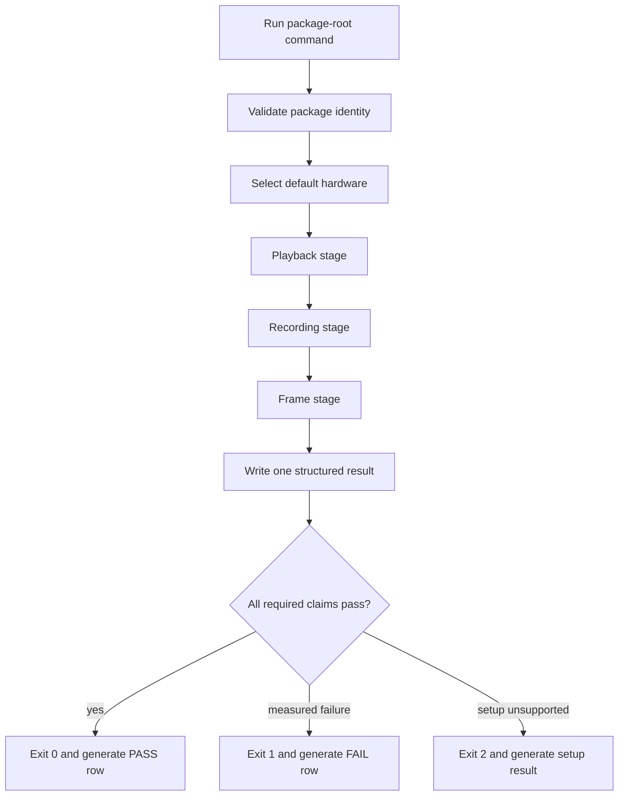

# H17 Packaged Hardware Verifier - Plan

## Goal Capsule

- **Objective:** let Dan unzip the Windows alpha package, run one command with no arguments, and receive a mechanical verdict for packaged playback, recording, and frame behavior on the default hardware.
- **Product authority:** ADR-0040 owns the package-level interface. ADR-0037, the H17 plan, and `docs/reality-lane.md` retain the locked gate thresholds and result-accounting rules.
- **Execution profile:** code, package wiring, CI negative controls, and one owner-machine run.
- **Open blockers:** none for implementation planning. Enabling ASIO is blocked until Dan explicitly accepts the Steinberg ASIO SDK licence terms.
- **Stop condition:** the package-root command is mechanically self-testing in CI and produces an honest owner-machine PASS or FAIL without a checkout, build tools, UI operation, listening, or visual judgment.

---

## Product Contract

### Summary

The Windows portable alpha will ship one self-contained hardware verification command. It will automatically exercise the packaged playback, recording, and dense-Timeline frame paths, then emit one structured result and one plain PASS or FAIL summary.

### Problem Frame

The Reality lane is mechanically defined but not owner-usable from the package. Playback resolves a build-tree executable, the frame smoke configures and builds the repository, and the recording smoke does not exist. A user who only has the portable zip cannot run the proof that H17 requires.

The current Windows machine also exposes an important truth the verifier must preserve: shared and exclusive WASAPI grant Blocks larger than the locked 128-frame target. The tool must explain that failure and pursue the supported low-latency backend route, never lower the target to create a green result.

### Key Decisions

- **Package-root workflow** (session-settled: user-directed — chosen over a manual UI or developer workflow: Dan does not use those workflows). Governs R1-R4.
- **Automatic hardware defaults** (session-settled: user-approved — chosen over a device picker: the verifier must be usable without UI knowledge). Governs R5-R7.
- **Measured evidence is the only PASS authority** (session-settled: user-approved — chosen over hand-written verification notes: every claim must be mechanically derived). Governs R8-R11.
- **Keep the 128-frame target** (session-settled: user-approved — chosen over crediting the observed 480-frame stability run: the plan's latency gate remains binding). Governs R12-R14.
- **One orchestrator, three explicit stages.** Playback, recording, and frame evidence remain separately attributable while producing one final verdict. Governs R15-R19.

### Requirements

**Owner workflow and package boundary**

- R1. The Windows portable package must contain one root-level hardware-verification command.
- R2. Running the command with no arguments must be the documented normal path.
- R3. The normal path must not require a repository checkout, CMake, a compiler, a development server, or app UI operation.
- R4. Every executable used for gate credit must come from the extracted package and match that package's version identity.

**Automatic hardware selection**

- R5. The verifier must automatically select the default usable input and output devices.
- R6. On Windows, the verifier must follow a deterministic backend preference that uses a packaged ASIO capability when available before supported WASAPI low-latency modes.
- R7. The result must identify every backend and device attempt, including the reason an attempt was rejected.

**Evidence and verdict**

- R8. The verifier must write one machine-readable result containing package identity, stage verdicts, measured values, failure reasons, and the final verdict.
- R9. The verifier must print a concise human-readable summary that requires no interpretation of raw logs.
- R10. Exit code `0` must mean all required claims passed, `1` a measured gate failure, and `2` unsupported or incomplete setup.
- R11. A proposed `docs/reality-lane.md` result row must be generated from the structured measurements; no human or agent may manually upgrade its classification.

**Playback**

- R12. Playback must use a real Project through the packaged runtime and request 48 kHz with a 128-frame Block.
- R13. Playback must fail when the granted Block exceeds 128 frames, any authoritative Underrun occurs, any applicable deadline or callback budget is breached, the device reports an error, the Project path does not render, or required loopback evidence is invalid.
- R14. A run at any relaxed Block size may be retained as diagnostic evidence but must not earn the locked playback PASS.

**Recording**

- R15. Recording must arm and capture through the packaged runtime, persist the result as the canonical bundle-owned float-WAV Asset and Take metadata, reopen it, and assert non-silence and format validity.
- R16. When hardware loopback ground truth is available, recording must also assert compensated placement within the calibrated tolerance and report the alignment error in frames.
- R17. When loopback ground truth is unavailable, the result must identify the recording claim as capture-only and must not imply that round-trip alignment was proved.

**Frame**

- R18. The package must run the dense-Timeline frame check without configuring or building the repository.
- R19. The frame stage must fail on blank output or a sustained frame time above 16.6 ms.

**Gate integrity**

- R20. CI must prove that missing or mismatched package files, a granted Block above 128, synthetic Underruns, silent or invalid recording output, invalid loopback alignment, blank frame output, and an over-budget frame all prevent PASS.
- R21. The owner-machine command must always preserve its structured evidence on PASS, measured failure, setup failure, and crash detection.

### Actors

- A1. **Dan:** extracts the portable package and runs its one verification command.
- A2. **Packaged verifier:** selects hardware, runs each stage, applies verdict policy, and writes evidence.
- A3. **CI:** exercises package-boundary and negative-control behavior without claiming real-hardware PASS.
- A4. **Agent:** reviews and commits script-generated Reality-lane evidence without changing its classification.

### Key Flows

- F1. Package verification
  - **Trigger:** A1 runs the package-root command with no arguments.
  - **Actors:** A1, A2
  - **Steps:** A2 validates package identity, selects default hardware, runs playback, recording, and frame stages, then writes one result.
  - **Outcome:** the console and result artifact agree on PASS, measured FAIL, or setup failure.
  - **Covers:** R1-R19, R21.
- F2. Reality-lane evidence handoff
  - **Trigger:** F1 reaches a terminal verdict.
  - **Actors:** A2, A4
  - **Steps:** A2 generates a dated result row from measurements; A4 verifies provenance and commits it without editing the classification.
  - **Outcome:** git records the real-machine fact without agent-authored evidence.
  - **Covers:** R8-R11, R21.
- F3. Gate mutation check
  - **Trigger:** package CI runs a named negative control.
  - **Actors:** A3
  - **Steps:** A3 injects one prohibited condition and invokes the same verdict policy used by the package.
  - **Outcome:** the job proves that the condition prevents PASS.
  - **Covers:** R20.

### Acceptance Examples

- AE1. Clean package success
  - **Covers:** R1-R13, R15-R19, R21.
  - **Given:** a clean extracted package, supported default devices, and required loopback capability.
  - **When:** Dan runs the root verifier with no arguments.
  - **Then:** all three stages pass, one result records the package and device measurements, and the process exits `0`.
- AE2. Device refuses the target Block
  - **Covers:** R7, R10, R12-R14, R21.
  - **Given:** the requested Block is 128 frames and the selected backend grants 480.
  - **When:** playback completes without an Underrun.
  - **Then:** the final verdict is still FAIL, the granted Block is recorded, and the process exits `1`.
- AE3. No loopback ground truth
  - **Covers:** R10, R15-R17, R21.
  - **Given:** default input capture is available but no hardware loopback path can be proved.
  - **When:** recording capture, persistence, reopen, non-silence, and format checks pass.
  - **Then:** the recording evidence is labeled capture-only and makes no latency-alignment claim.
- AE4. Package contamination
  - **Covers:** R4, R8, R10, R20-R21.
  - **Given:** a checker is missing, modified, or resolves outside the extracted package.
  - **When:** verification starts.
  - **Then:** no stage receives PASS credit, evidence names the package-boundary failure, and the process exits nonzero.
- AE5. Frame regression
  - **Covers:** R10, R18-R21.
  - **Given:** the packaged dense-Timeline check renders blank output or exceeds 16.6 ms.
  - **When:** the frame stage finishes.
  - **Then:** the overall verdict is FAIL and the failing measurement is preserved.

### Scope Boundaries

- The verifier does not automate the DAW GUI or ask Dan to listen, watch, inspect, or choose a device.
- It does not lower the 128-frame target, reinterpret diagnostic stability as gate credit, or convert capture-only recording evidence into alignment proof.
- It does not add an installer, signing, telemetry, or public-beta distribution work.
- It does not automatically edit the repository; it emits evidence that can be reviewed and committed.
- It does not include the real-plugin worker smoke, which remains a separate Reality-lane concern.

### Dependencies and Assumptions

- ADR-0040 is the interface authority; ADR-0037 and `docs/reality-lane.md` remain the result-accounting authority.
- The ASIO route depends on explicit owner acceptance of Steinberg's SDK licence terms and a documented build/redistribution path.
- Full recording alignment depends on a device-provided loopback channel or a physical loopback cable.
- CI can prove orchestration, package isolation, schema, and negative controls but cannot manufacture real hardware evidence.

### Outstanding Questions

**Deferred to planning**

- Whether one console binary owns all three stages or the package command composes dedicated packaged checkers.
- The stable result-schema fields and compatibility policy.
- The exact ASIO SDK acquisition and CI-build mechanism after owner licence acceptance.

### Sources and Research

- `STATUS.md`
- `docs/reality-lane.md`
- `docs/plans/2026-07-03-h17-distribution-alpha-plan.md`
- `docs/adr/0035-h13-recording-and-device-ux.md`
- `tools/soak/SoakMain.cpp`
- `tools/soak.ps1`
- `tools/package.ps1`
- `tools/ui-frame-smoke.ps1`
- [JUCE 8.0.4 audio-device configuration](https://github.com/juce-framework/JUCE/blob/8.0.4/modules/juce_audio_devices/juce_audio_devices.h)
- [JUCE 8.0.4 ASIO integration requirements](https://github.com/juce-framework/JUCE/blob/8.0.4/modules/juce_audio_devices/juce_audio_devices.cpp)
- [JUCE audio device enumeration](https://docs.juce.com/master/classjuce_1_1AudioIODeviceType.html)
