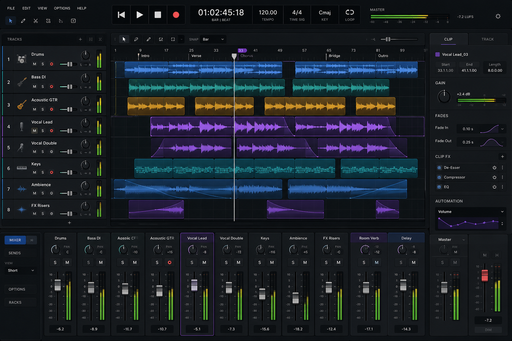

# YES DAW — Product

> The product spec — what YES DAW is and what it does. Also the file to hand a UI generator
> ("generate a UI from this"). It describes the product and the main screen; a generated mockup is a
> look-and-feel exploration only. The implementation **leans native** (JUCE Components + a GPU timeline
> canvas — plan-recommended and cost-validated by the H0 timeline spike); the formal UI-stack ADR
> (fork #2) lands at H1.

## Reference mockup (the agreed look)

The committed UI north-star: [`docs/design/arrangement-view-reference.png`](docs/design/arrangement-view-reference.png).
A **look-and-feel target, not a literal spec** — it spans horizons: the timeline + tracks + clips +
mixer + transport + inspector are **H2** (most of which is "draw the engine that already exists"); the
per-clip insert chains (Clip FX — De-Esser / Compressor / EQ) and the send/return strips (Room Verb,
Delay) are **plugin hosting, H3**. Implementation is native JUCE (Components + GPU timeline canvas), not
this web render.

## What it is
A from-scratch, **professional general-purpose multi-track DAW** — Logic Pro / Pro Tools / Cubase /
Sonar class. Desktop app. The **linear timeline** is the core, and the thing it must be great at first
is **multi-track audio editing**: placing and editing clips on a timeline, then mixing them.

## Who it's for & the vibe
A serious music producer / engineer. Aesthetic: **modern, dark, focused, high-contrast, dense but
clean** — pro-audio polish (Ableton / Bitwig / Logic territory), not a toy. Keyboard-driven, fast,
GPU-crisp. Information-dense without feeling busy.

## Core workflow (the thing it must make easy)
Import audio → it lands as **clips** on **tracks** → cut / split / trim, drag to move, drag fade
handles, set clip gain → balance with the mixer **faders** → export. Editing on the timeline is the hero.

## The main screen — the arrangement view (single window)
- **Transport bar (top):** play / stop / record, current time + tempo + time signature, a loop toggle,
  master output level meter.
- **Track list (left):** stacked tracks — name, arm / mute / solo, small level meter, fader + pan.
- **Timeline / arrangement (center, the focus):** bars-&-beats ruler; each track a horizontal lane;
  audio in **clips** (rounded blocks showing a **waveform** with fade handles); a vertical **playhead**;
  snap grid; selection highlight.
- **Inspector (right, collapsible):** selected track / clip properties (gain, fades…).
- **Bottom panel (contextual, collapsible):** the **mixer** — a channel strip per track + buses (fader,
  pan, level meter, sends), ending in a **master** strip.

## On-screen objects (canonical terms — see CONTEXT.md)
Track · Clip · Bus · Master bus · Fader · Pan · Level meter · Transport / playhead · bars-&-beats ruler
· markers · automation lane · send. *(No MIDI / piano-roll in the first mockup — audio-first.)*

## For UI generation
Produce a polished, realistic desktop mockup of the arrangement view above (wide proportions, dark
theme). A generated web/React mockup is a **look-and-feel exploration**, not the implementation — the
engine is C++/JUCE and the UI leans **native** (Components + GPU timeline canvas), with the formal
UI-stack ADR at H1.
